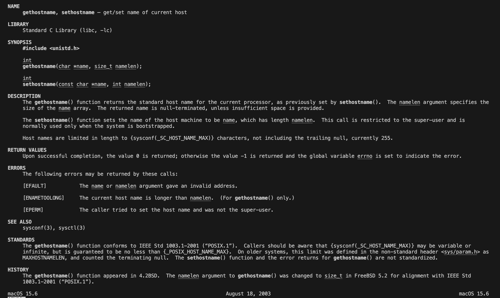

# Lab 1.1 Host Resolution

This is the first assignment, where you will resolve a host name into an IPv4 address. It serves as an short (and hopefully easy) introduction to network programming using the BSD socket API in C/C++.

## Part I Resolving a host by name

For our first program we set the modest goal of turning a host/domain name, such as xkcd.com or remote5.student.chalmers.se, into an IP address. So, when we’re finished, we want to be able to do the following with our program:

```bash
$ ./lab1-resolve-host xkcd.com
Resolving ‘xkcd.com’ from ‘mieli’:
IPv4: 107.6.106.82
```

### 1.a A first look at the code

Grab the code from Canvas. Compile and run it. You should see something similar to the following:

```bash
$ ./lab1-resolve-host xkcd.com
Resolving ‘xkcd.com’ from ‘mieli’:
```

As you can see, the critical part (the IPv4 address) is missing. We’ll be adding that in a moment. (This is what we should do!!!) What you can see, however, is the name of your computer. (In the examples the name is ‘mieli’, which is the name of the computer I was logged in on when writing this document. Obviously your output may be different, depending on the name of your computer!) Look in the code - there name of the computer is retrieved using a function called `gethostname()` . If you’re not already familiar with this function, check its $man-page$ (to view a man-page from the terminal, type `man foo`, where you replace `foo` with the keyword you're interested in):

The man-page (or other equivalent documentation) will generally tell you

- Where the function is declared

- How to invoke the function (arguments, return type/value, ...)

- What the function does (see section DESCRIPTION)

- What errors can occur

We’ll have to be especially careful with the final item: ignoring potential errors is never a good idea! It’s even worse in network programming, since improperly handled errors may in the end introduce bugs that might compromise security and might give evil people access to our machine remotely.



Handling errors properly is difficult. In the programs presented here, we’ll generally print an error message and then exit. This is, of course, not always a good idea. Imagine a server handling multiple clients. We don’t want to shut down the whole server just because a single client had an network error – this would deny service to all the other clients!


Exercise I.a.1 On my machine, the man-page for `gethostname()` lists four errors:

1. `EFAULT` name is an invalid address

2. `EINVAL` len is negative or, for `sethostname()` , len is larger than the maximum allowed size.

3. `ENAMETOOLONG` (glibc `gethostname()`) len is smaller than the actual size. (Before version 2.1, glibc uses EINVAL for this case.)

4. `EPERM` For `sethostname()`, the caller did not have the `CAP_SYS_ADMIN` capability.

Check the man-pages for any functions that you encounter and are unfamiliar with.

## Resolving a host name

Resolving host names is fairly common task.

Basically, the two most common choices are

- `gethostbyname()`

- `getaddreinfo()`

Both of these are available on Linux, MacOS and Windows (and probably most other semicompetent OSes) through the respective BSD networking implementations and standard libraries. The former, `gethostbyname()`, should however be considered deprecated and you should no longer use it in any new software that you write (assuming `getaddrinfo()` is available).

Therefore, we should use `getaddrinfo()` for this exercise. We can get it to return IPv6 addresses with relative ease.

Also, `getaddrinfo()` is thread-safe and re-entrant, since memory is allocated for the result of each call of `getaddrinfo()`. This is also why you should call `freeaddrinfo()` -- otherwise each call to `getaddrinfo()` will allocate additional memory, and you’ll have a memory leak.

The `gethostbyname()` method, on the other hand, returns its result in a static `hostent` structure to which it returns a pointer. After each call to `gethostbyname()` you must extract the data from the returned pointer and store it elsewhere: the next call to `gethostbyname()` will overwrite the data in the hostent structure!

Read the man-page/documentation for `getaddrinfo()`. Depending on the version of your manpage, it might even contain some examples!

## Representing addresses

`getaddrinfo` uses the `addrinfo` struct to store and represent addresses. Unfortunately, this is not the whole story. Specifically, we need to look closer at the `ai_addr` member of type `sockaddr`.

```bash
man getaddrinfo
SYNOPSIS
     #include <sys/types.h>
     #include <sys/socket.h>
     #include <netdb.h>

     int
     getaddrinfo(const char *hostname, const char *servname,
         const struct addrinfo *hints, struct addrinfo **res);

     void
     freeaddrinfo(struct addrinfo *ai);

DESCRIPTION
     The getaddrinfo() function is used to get a list of IP addresses and port numbers
     for host hostname and service servname.  

     hints is an optional pointer to a struct addrinfo, as defined by ⟨netdb.h⟩:

     struct addrinfo {
             int ai_flags;           /* input flags */
             int ai_family;          /* protocol family for socket */
             int ai_socktype;        /* socket type */
             int ai_protocol;        /* protocol for socket */
             socklen_t ai_addrlen;   /* length of socket-address */
             struct sockaddr *ai_addr; /* socket-address for socket */
             char *ai_canonname;     /* canonical name for service location */
             struct addrinfo *ai_next; /* pointer to next in list */
     };

     This structure can be used to provide hints concerning the type of socket that the
     caller supports or wishes to use.  The caller can supply the following structure
     elements in hints:

     ai_family      The protocol family that should be used.  When ai_family is set to
                    PF_UNSPEC, it means the caller will accept any protocol family
                    supported by the operating system.

     ai_socktype    Denotes the type of socket that is wanted: SOCK_STREAM, SOCK_DGRAM,
                    or SOCK_RAW.  When ai_socktype is zero the caller will accept any
                    socket type.

     ai_protocol    Indicates which transport protocol is desired, IPPROTO_UDP or
                    IPPROTO_TCP.  If ai_protocol is zero the caller will accept any
                    protocol.
```

The sockaddr structure like the following:

```bash
man bind
SYNOPSIS
       #include <sys/socket.h>

       int bind(int sockfd, const struct sockaddr *addr,
                socklen_t addrlen);

struct sockaddr {
sa_family_t sa_family;
char sa_data[14];
}
```

The only interesting field is the `sa_family`, which tells us the address family of this instance of `sockaddr`.

Our main interest for now is the  AF_INET address family, which represents IPv4 addresses. There are others, such as AF_INET6, AF_UNIX, and so on. Each address family has a corresponding ET6, AF_UNIX, and so on. Each address family has a corresponding socket address structure:

- AF_INET has sockaddr_in

- AF_INET6 has sockaddr_in6

- AF_UNIX has sockaddr_un

- ...

```
man 7 ip
struct sockaddr_in {
               sa_family_t    sin_family; /* address family: AF_INET */
               in_port_t      sin_port;   /* port in network byte order */
               struct in_addr sin_addr;   /* internet address */
           };

           /* Internet address */
           struct in_addr {
               uint32_t       s_addr;     /* address in network byte order */
           };
```


